# GitHub Copilot Instructions Demo - Safeguards AI Workflow Demonstration

## 🎯 Demo Scenario Overview

This project is the **third installment** in a comprehensive AI development workflow series, demonstrating the evolution from reactive to **safeguards-driven development practices**.

**Demo Series Evolution:**
- **[GitHub MCP Demo](https://github.com/david-pizzi-cg/github-mcp-demo)**: Human-guided AI workflow (AI as tool)
- **[GitHub Coding Agent Demo](https://github.com/david-pizzi-cg/github-coding-agent-demo)**: Autonomous AI workflow (AI as teammate)
- **This Demo**: **Safeguards AI workflow (AI as quality gatekeeper)**

This project demonstrates how **GitHub Copilot Instructions** can be used to create specialized AI personas that catch common development issues before they reach version control, using a CSS stylesheet bug as a case study.

## 📋 Demo Scenario: Catching the CSS Bug Through AI Safeguards

### 🐛 **The Demo Scenario**

This demo starts with a **working World Clock web application** and then demonstrates how AI safeguards catch bugs during development:

**Starting State**: Fully functional website with correct CSS reference  
**Demo Action**: Manually introduce CSS typo to simulate common development error  
**Target Bug**: `<link rel="stylesheet" href="styls.css">` ❌ (missing 'e')  
**Correct Reference**: `<link rel="stylesheet" href="styles.css">` ✅

**Traditional Approach**: Fix bugs after they're discovered in production  
**Safeguards Approach**: **Catch and fix bugs automatically before they reach version control**

### 🧠 **The Safeguards Strategy**

Instead of fixing bugs after they reach production, this demo shows how to use **GitHub Copilot Instructions** to create quality-focused AI behavior that catches issues during development:

1. **Prompt Engineer Agent**: Specialized agent for creating well-structured, effective prompts for any development task
2. **Enhanced General Instructions**: Always-on DevOps practices embedded in default Copilot behavior
3. **Automatic Quality Gates**: AI enforces testing before any code commits
4. **Pre-Commit Bug Detection**: Issues caught and fixed during normal development workflow

## 🎯 Learning Objectives

This demo showcases:
- **GitHub Copilot Instructions**: Creating specialized AI personas for different development roles
- **Pre-Commit Quality Gates**: Using AI to catch issues before they reach version control
- **Prompt Engineering**: Best practices for creating effective AI instructions and reusable prompts
- **Automated Safeguards**: Integrating testing and quality checks into the development workflow seamlessly
- **DevOps Integration**: AI-enforced quality gates and PR standards
- **Agent Creation**: Building specialized AI personas for specific development tasks

## 🔄 Workflow Diagram

```mermaid
graph TD
    P[🔧 Pre-Demo Setup: Create Demo Branch]
    P --> A[👨‍💻 Phase 1: Create Prompt Engineer Agent]
    A --> B[📝 Phase 2: Generate File Reference Validation Prompt]
    B --> C[🧪 Phase 3: Execute File Validation Testing Prompt]
    C --> D[⚙️ Phase 4: Enhance General Copilot Instructions]
    D --> E[🛡️ Phase 5: Manually Introduce Bug & Test Safeguards]
    E --> F[🔧 Complete Demo Cleanup: Delete Demo Branch]
    
    P1["Create 'demo' branch for safe demonstration"] --> P
    A1["Configure specialized prompting agent"] --> A
    B1["AI generates simple file validation prompt"] --> B
    C1["Execute prompt to add Jest file reference tests"] --> C
    D1["Update .github/copilot-instructions.md with safeguards"] --> D
    E1["Manually introduce CSS bug, then trigger auto-detection & fix"] --> E
    F1["Delete demo branch locally"] --> F
    
    style P fill:#ff6b6b
    style A fill:#4ecdc4
    style B fill:#45b7d1
    style C fill:#96ceb4
    style D fill:#feca57
    style E fill:#ff9ff3
    style F fill:#ff6b6b
```



## 🎮 How to Run the Demo

This interactive demo shows how to build AI-powered safeguards that catch bugs before they reach version control. You'll transform your workflow from reactive bug fixing to proactive prevention.

**🎯 What You'll Experience:**
Evolution from "fix bugs after discovery" to "prevent bugs before they happen" using intelligent AI safeguards in your development environment.

### **Prerequisites**

- **VS Code with GitHub Copilot**: AI development companion ready for new behaviors
- **Basic unit testing knowledge**: Familiarity with automated testing concepts
- **Git repository**: Local or remote for safe experimentation
- **🌟 Starting Point**: Fully functional World Clock website

### **🔧 MCP Server Setup (Optional)**

While this demo focuses on Copilot Instructions rather than GitHub operations, you may want the GitHub MCP Server for additional functionality:

1. **Open VS Code** in this project directory
2. Press **Ctrl+Shift+P** to open the Command Palette and search for `MCP: Show Installed Server`
3. The **MCP Servers - Installed** panel will appear in the bottom left of VS Code
4. Find **github** in the list, right-click it, and select **Start Server** (if present)
5. **Verify connection** – the server should show as "Connected" or "Running"

**Note**: This demo primarily uses local development and testing, so MCP server is optional but can enhance the experience with additional GitHub integration capabilities.

**Troubleshooting:**
- If no Start button or MCP server appears, ensure the `.vscode/mcp.json` file exists
- Restart VS Code if the MCP server doesn't appear
- The demo will work fine without MCP server for the core safeguards functionality
- **For detailed MCP setup instructions**: [GitHub MCP Server Documentation](https://github.com/github/github-mcp-server)
- **For MCP with Copilot Chat**: [GitHub Copilot MCP Documentation](https://docs.github.com/en/copilot/how-tos/provide-context/use-mcp/extend-copilot-chat-with-mcp)

### **The Journey Ahead: Quick Start Overview**

1. **🔧 Setup & Verification**: Start with working application, prime environment for AI-enhanced workflows
2. **🌱 Foundation Building**: Create specialized AI personas and establish quality gates
3. **🎭 The Grand Demonstration**: Introduce a bug and watch AI safeguards detect, fix, and validate automatically
4. **✨ Witness the Magic**: See bugs caught and fixed before they cause damage

**Ready?** Follow the phases below to build a comprehensive safeguards system.

### **Pre-Demo Setup: Create Demo Branch** 🔧

**🎪 Setting the Stage for Safe Experimentation**

Create a safe sandbox for experimenting without risk to your main codebase.

**What this phase achieves**: Creates a dedicated `demo` branch for safe experimentation. Build quality gates and test bug detection without affecting your main branch.

**User Prompt:**
```
Please create a new local 'demo' branch from main
```

**Expected AI Actions:**
- Create new `demo` branch locally from current main branch
- Switch to the demo branch for all subsequent work  
- Confirm branch isolation for safe demonstration
- Prepare for testing and bug detection workflow
- Ensure main branch remains untouched during demo
- No need to push demo branch to remote repository

### **Phase 1: Create Prompt Engineer Agent** 👨‍💻

**🎨 Crafting Your AI Specialist**

Create a specialized AI persona that excels at prompt engineering - your go-to expert for crafting effective, well-structured prompts for any development task.

**What this phase achieves**: Establishes an AI specialist that transforms how you communicate with AI, ensuring every request is optimally structured for success.

**User Prompt:**
```
I want to create a GitHub Copilot agent for a "Prompt Engineer" role, please create .github/agents/prompt-engineer.agent.md file. This agent should be an expert in creating well-structured, clear, and effective prompts for any development task.
```

**Expected AI Actions:**
- Create `.github/agents/prompt-engineer.agent.md` file
- Define specialized instructions for prompt engineering best practices
- Include guidelines for prompt structure, clarity, and specificity
- Provide templates for different types of development prompts  
- Configure agent to analyze requirements and generate actionable, well-crafted prompts
- Include guidelines for prompt structure, clarity, and specificity
- Provide templates for different types of development prompts
- Configure agent to analyze requirements and generate actionable, well-crafted prompts

### **Phase 2: Generate File Reference Validation Prompt** 📝

**🔍 Putting Your Prompt Engineer to Work**

See your Prompt Engineer agent in action! It will analyze the World Clock application and create a focused prompt for Jest-based file reference validation.

**What this phase achieves**: Demonstrates specialized AI personas by creating a surgical, well-structured prompt for testing file references. Simple and focused - checking that CSS and script files exist where HTML references them.

**User Prompt:**
```
@prompt-engineer Create a simple prompt that I can use to add Jest unit tests to this World Clock application. The tests should focus specifically on validating that all file references in HTML tags (like `<link>` and `<script>`) point to existing local files. This should be simple and focused. Please save this as a proper prompt file in .github/prompts/file-validation.prompt.md following GitHub prompt conventions.
```

**Expected AI Actions:**
- Apply the Prompt Engineer agent instructions from `.github/agents/prompt-engineer.agent.md`
- Analyze the World Clock application's HTML file structure
- Generate a simple, focused prompt for Jest-based file reference validation
- Create specific test scenarios for checking `<link>` and `<script>` tag file references
- Focus on local file existence validation (not hardcoded paths)
- Create `.github/prompts/file-validation.prompt.md` file with the well-structured prompt
- Follow proper GitHub prompt file conventions and formatting
- Keep the testing scope simple and manageable for replayable demos

### **Phase 3: Execute File Validation Testing Prompt** 🧪

**⚗️ From Blueprint to Reality**

Execute the crafted prompt to add Jest-based file reference validation. This creates the testing foundation that will catch the CSS bug in Phase 5.

**What this phase achieves**: Transform the specialized prompt into a working test suite. Creates detective system that validates file references and will catch missing/misnamed files.

**User Prompt:**
```
Please execute the file validation testing prompt file-validation.prompt.md to add Jest-based file reference validation to this World Clock application.
```

**Expected AI Actions:**
- Read and execute the prompt from `.github/prompts/file-validation.prompt.md`
- Create `package.json` with Jest testing framework and minimal configuration
- Create `__tests__/fileReferences.test.js` with file reference validation tests
- Install Jest and jsdom dependencies using `npm install`
- Run `npm test` to validate the testing infrastructure works correctly
- Ensure tests check if files in `<link>` and `<script>` tags exist
- Verify tests will catch the CSS file reference bug (styls.css vs styles.css)
- Confirm all tests pass with current correct file references
- Set up foundation for safeguards demonstration in Phase 5

### **Phase 4: Enhance General Copilot Instructions** ⚙️

**🛡️ Creating Your AI Quality Guardian**

Transform GitHub Copilot from helpful assistant to vigilant quality guardian that enforces testing before any commits.

**What this phase achieves**: Rewrite core Copilot instructions to establish comprehensive DevOps practices. Creates AI behavior that automatically refuses commits unless all tests pass.

**User Prompt:**
```
Now I want to rewrite the main .github/copilot-instructions.md file to establish comprehensive DevOps best practices and quality gates. The AI must always enforce that unit tests pass before any code changes and maintain the strictest testing requirements.
```

**Expected AI Actions:**
- **Completely rewrite** `.github/copilot-instructions.md` with comprehensive DevOps best practices
- Establish **mandatory testing protocol** with zero tolerance for failing tests
- Create **AI assistant behavior requirements** that enforce pre-flight test checks
- Include **forbidden actions** preventing code changes when tests fail
- Configure **test-first development workflow** as the default behavior
- Add **advanced quality gates** for performance, security, and accessibility
- Document **complete cleanup protocols** and commit standards
- **Critical**: New instructions create safeguards that automatically run tests before commits
- **Critical**: AI will enforce "tests must pass before proceeding" during Phase 5 commit attempt

### **Phase 5: Manually Introduce Bug & Demonstrate Detection** 🛡️

**🎪 The Grand Finale: Safeguards in Action**

Deliberately introduce the CSS bug and watch AI safeguards automatically detect, fix, and validate before allowing commit to proceed.

**What this phase achieves**: Demonstrate AI-powered quality gates working as designed. Watch AI catch bugs during commit attempts, fix them automatically, and ensure tests pass.

**Step 5a: Manually Introduce the Bug**

**⚠️ IMPORTANT: Manual Edit Required (Do NOT use Copilot for this step)**

**🕵️ The Stealth Operation**: Perform this edit manually to avoid AI awareness before the demonstration.

**User Instructions:**
1. **Manually open** `index.html` in the editor (no AI assistance!)
2. **Find line 7**: `<link rel="stylesheet" href="styles.css">`  
3. **Manually edit** to create the typo: `<link rel="stylesheet" href="styls.css">` (remove the 'e')
4. **Save the file** using Ctrl+S (or Cmd+S on Mac)

**🎯 Critical Note**: Do NOT ask Copilot to make this change or the safeguards demo won't work - AI must discover the bug during commit attempt.

**Step 5b: Trigger Safeguards Through Commit Attempt**

**🎬 The Moment of Truth**

Innocently attempt to commit changes and watch AI spring into action with quality-obsessed behavior.

**User Prompt:**
```
Perfect! Now let's commit all these Copilot improvements we've added to the demo branch.
```

**Expected AI Actions (The Safeguards Symphony):**
- 🔍 **Run mandatory pre-commit test validation** (`npm test`) as required by DevOps quality gates
- 🚨 **Tests fail** due to CSS link typo - AI must STOP immediately
- 🕵️ **Identify the specific issue**: Missing file `styls.css` referenced in HTML
- 🛠️ **Fix the bug**: Correct `href="styls.css"` to `href="styles.css"` in `index.html`
- ✅ **Re-run tests** to validate the fix works (`npm test` - all tests pass)
- 🎉 **Only then proceed with commit** using conventional commit format with test evidence
- 📋 **Include test results** in commit message to demonstrate quality gates working
- 🛡️ **Show safeguards workflow**: Bug caught → Fixed → Validated → Committed safely

**User Prompt:**
```
Perfect! Now let's commit all these Copilot improvements we've added to the demo branch.
```

**Expected AI Actions:**
- **Run mandatory pre-commit test validation** (`npm test`) as required by DevOps quality gates
- **Tests fail** due to the CSS link typo - AI must STOP immediately
- **Identify the specific issue**: Missing file `styls.css` referenced in HTML
- **Fix the bug**: Correct `href="styls.css"` to `href="styles.css"` in `index.html`
- **Re-run tests** to validate the fix works (`npm test` - all tests pass)
- **Only then proceed with commit** using conventional commit format with test evidence
- **Include test results** in commit message to demonstrate quality gates working
- **Show safeguards workflow**: Bug caught → Fixed → Validated → Committed safely

### **Complete Demo Cleanup: Delete Demo Branch** 🔧

**What this phase achieves**: Cleans up the demonstration by deleting the local demo branch and returning to a clean main branch state. This shows the complete lifecycle of a safe, isolated demonstration workflow.

**User Prompt:**
```
The demo is complete! Please clean up by deleting the demo branch locally, switch back to main branch, and make sure to remove any directories that remain after branch deletion.
```

**Expected AI Actions:**
- Switch back to main branch (`git checkout main`)
- Delete local `demo` branch (`git branch -D demo`)
- **Remove all directories** that remain from demo (including `node_modules` with Jest dependencies)
- Use PowerShell command to remove non-empty directories: `Remove-Item -Path "node_modules" -Recurse -Force`
- Remove any other demo artifacts (`.github/agents`, `.github/prompts` if they exist on main)
- Verify complete cleanup with `git status` and directory listing
- Confirm workspace restored to original main branch state

**Additional Cleanup Note**: After branch deletion, ensure any empty folders created during the demo are also removed, as Git branch deletion doesn't automatically clean up empty directories that may remain in the workspace.

**Result**: Repository returns to original clean state with main branch intact, demonstrating how safeguards can be tested and validated in isolation without affecting production code.

## 📚 Key Takeaways

### **Branch Management Benefits:**

| Approach | Main Branch Safety | Demo Repeatability | Cleanup Simplicity |
|----------|-------------------|-------------------|--------------------|
| **Direct on Main** | ❌ Risk of permanent changes | ❌ Requires manual cleanup | ❌ Complex rollback |
| **Demo Branch** | ✅ Completely protected | ✅ Perfect repeatability | ✅ Simple branch deletion |

### **Instruction Layer Comparison:**

| **Aspect** | **Specialized Agent** | **Enhanced General Instructions** |
|------------|----------------------|----------------------------------|
| **Activation** | Via explicit request or context | Always active by default |
| **Focus** | Creating effective prompts for any task | Enforcing quality standards |
| **Approach** | Specialized and methodical | Strict and always-on |
| **Output** | Well-structured prompts | Quality-checked code |
| **Use Case** | Generating any development prompts | Daily development workflow |

### **Safeguards vs Reaction:**

| Approach | When Issues Found | Development Speed | Quality Assurance |
|----------|------------------|-------------------|-------------------|
| **Reactive** | After production deployment | Fast initially, slow fixes | Manual verification |
| **Safeguards** | Before code commits | Consistent pace | Automated verification |

## 🚀 Next Steps

After completing this demo, you'll understand how to:
- Create specialized AI personas using GitHub Copilot Instructions
- Use prompt engineering to generate comprehensive development prompts
- Implement automated safeguards in your development workflow
- Integrate AI-driven quality gates into your DevOps processes

## 📚 Additional Resources

- [GitHub Copilot Instructions Documentation](https://docs.github.com/en/copilot/customizing-copilot/adding-custom-instructions-for-github-copilot)
- [Prompt Engineering Best Practices](https://platform.openai.com/docs/guides/prompt-engineering)
- [DevOps Quality Gates](https://docs.microsoft.com/en-us/azure/devops/pipelines/release/approvals/gates)
- [JavaScript Unit Testing Guide](https://jestjs.io/docs/getting-started)

---


**Ready to demonstrate how AI can catch and fix bugs before they reach version control!** 🚀
